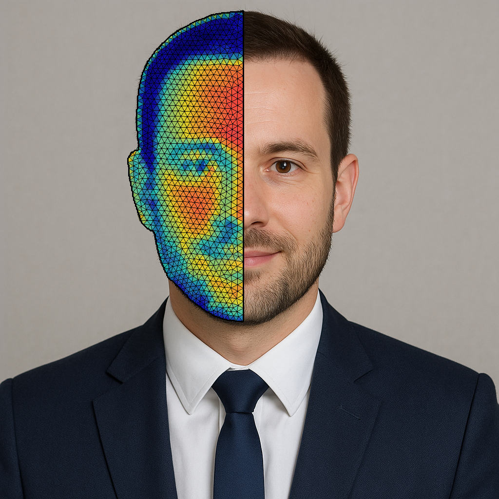
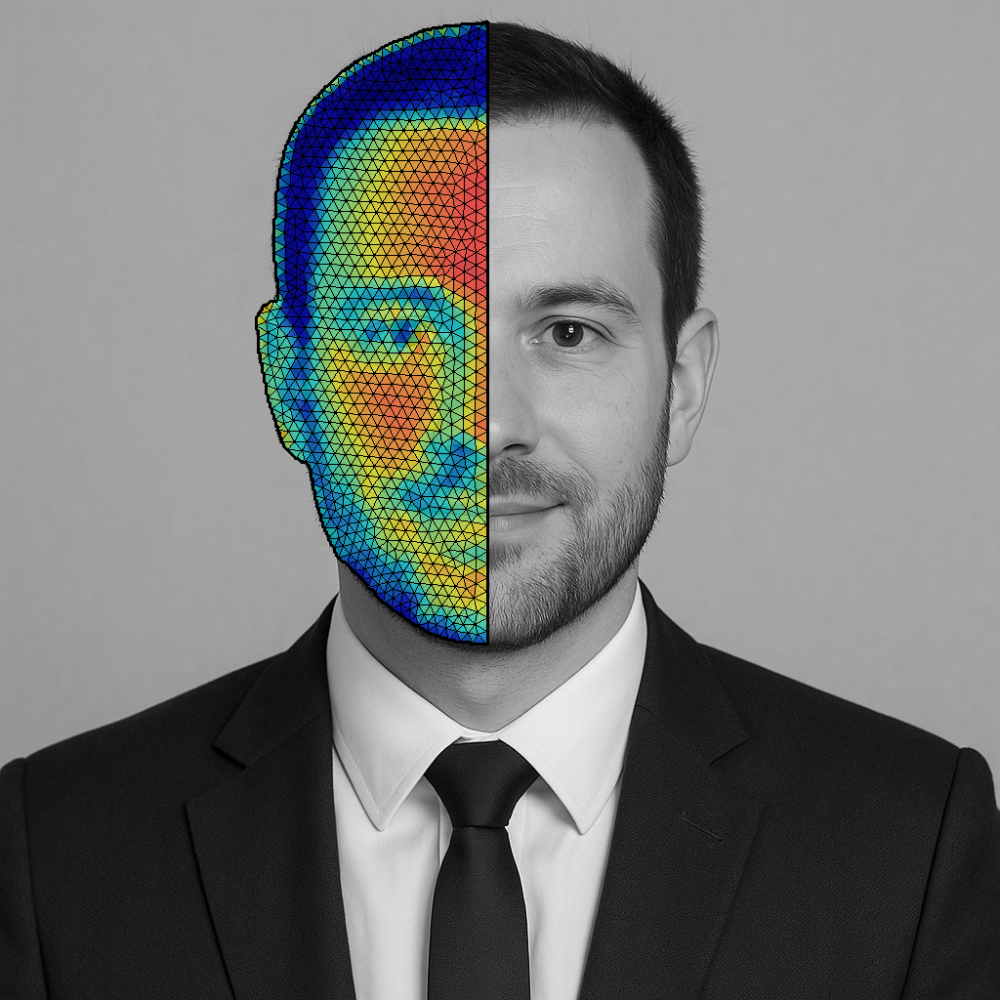
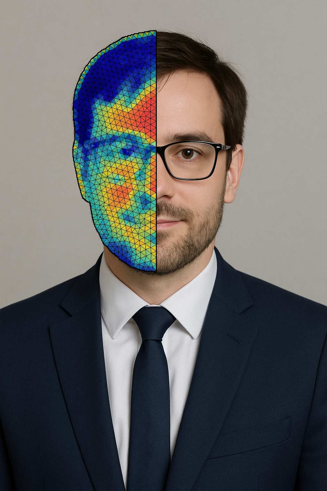
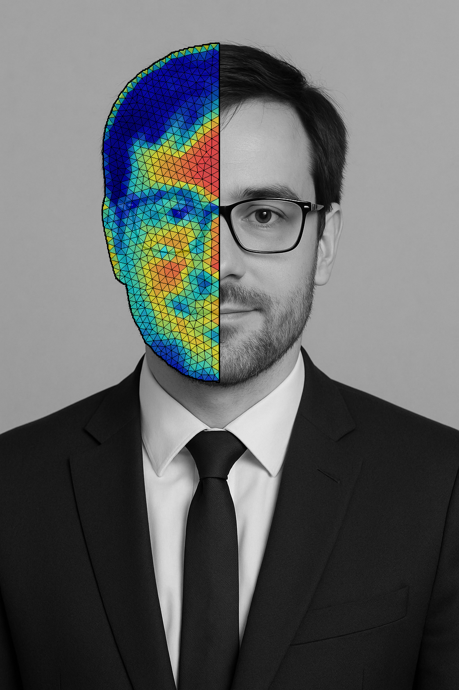

## Photo Mesh Pipeline

Extract a face contour from a photo, generate a 2D triangular mesh with Gmsh, and overlay a synthetic PDE solution on the face region.

### Features
- Face parsing with BiSeNet (pretrained weights) - configurable segmentation (face-only or full body)
- **Angled face midline detection** - automatically calculates midline from segmentation mask that follows face orientation (works for tilted faces)
- 2D mesh generation from the face contour (Gmsh)
- Synthetic PDE visualization and image-colored mesh overlays
- Clean input/output separation (`inputs/` → `output/`)

### Requirements
- Python 3.11 (recommended)
- System packages: none required beyond a working Python toolchain

### Setup
```bash
python3 -m venv venv
source venv/bin/activate
pip install -U pip
pip install -r requirements.txt
```


### Model and Weights
This project uses an open-source BiSeNet implementation and pretrained weights:

- `model.py` and `resnet.py` are adapted from the Face Parsing BiSeNet implementation (CelebAMask-HQ):
  - Repository: `https://github.com/zllrunning/face-parsing.PyTorch`
  - Original backbone and segmentation modules were refactored locally for this pipeline.

- Pretrained parsing weights (BiSeNet on face parsing) can be downloaded from the same repository releases or mirrors, for example:
  - `79999_iter.pth` (checkpoint used here): `https://drive.google.com/file/d/154JgKpzCPW82qINcVieuPH3fZ2e0P812/view` (linked from the repo README)

Place the downloaded `79999_iter.pth` in the project root before running.

### Project Layout
- `main.py` — pipeline entrypoint and CLI
- `model.py`, `resnet.py` — BiSeNet model and backbone
- `writer_dat.py` — writes subdivided Tecplot `.dat` from the coarse mesh and image
- `inputs/` — put your input images here (e.g., `input_01.jpg`)
- `output/` — all generated artifacts per input image basename

### Usage
Run the pipeline on an input image (with optional alpha):
```bash
source venv/bin/activate
python main.py inputs/input_01.jpg --alpha 0.6
```

#### Face Midline
The pipeline **automatically calculates an angled face midline** from the segmentation mask that follows the face orientation. This works for both front-facing and tilted faces:
- Calculates midline using face center points at different heights (forehead, nose, chin)
- Extends the line to image boundaries
- Automatically handles face tilt/rotation

If midline detection fails, the code falls back to a vertical cutoff at the image center.

#### Advanced Options
- Adjust cutoff position (fallback only, if midline detection fails):
```bash
python main.py inputs/input_03.png --cutoff-position 0.5 --alpha 0.6
```
- Legacy flag (now always uses angled midline):
```bash
python main.py inputs/input_03.png --use-face-midline --alpha 0.6
```

Outputs are written to `output/` with meaningful names that include alpha (percent):
- `<name>_overlay_color_alphaXX.png` (color background)
- `<name>_overlay_gray_alphaXX.png` (grayscale background)

Examples: `input_03_overlay_color_alpha60.png` for alpha=0.6.

#### Additional Visualization Options
- Show mesh nodes as dots:
```bash
python main.py inputs/input_03.png --show-mesh-nodes --alpha 0.6
```
- Show Voronoi diagram:
```bash
python main.py inputs/input_03.png --show-voronoi --alpha 0.6
```
- Use different (coarser) mesh for contour visualization:
```bash
python main.py inputs/input_03.png --use-different-contour-mesh --alpha 0.6
```

### Examples

<table>
  <thead>
    <tr>
      <th>Input</th>
      <th>PDE contour overlay</th>
      <th>Solution coarse mesh</th>
    </tr>
  </thead>
  <tbody>
    <tr>
      <td></td>
      <td></td>
      <td></td>
    </tr>
    <tr>
      <td></td>
      <td></td>
      <td></td>
    </tr>
  </tbody>
  </table>

### Face Segmentation Configuration
The pipeline uses BiSeNet with 19 face parsing classes from CelebAMask-HQ and supports label presets and overrides:

Presets:
- `face` (default): excludes neck (14), necklace (15), clothing (16) - **only meshes the face region**
- `full`: includes neck, necklace, clothing

Use a preset:
```bash
# Default is 'face' mode
python main.py inputs/input_03.png --alpha 0.6

# Use full body segmentation
python main.py inputs/input_03.png --segmentation-mode full --alpha 0.6
```

Override labels explicitly (comma-separated list of class IDs):
```bash
python main.py inputs/input_03.png --labels-to-keep "1,2,3,4,6,7,8,10,11,12,13,14,15,16,17,18"
```

Notes:
- Class IDs (BiSeNet 19-class):
  - 0: Background, 1: Skin, 2: Left Brow, 3: Right Brow, 4: Left Eye, 5: Right Eye
  - 6: Glasses, 7: Left Ear, 8: Right Ear, 9: Ear Ring, 10: Nose, 11: Mouth
  - 12: Upper Lip, 13: Lower Lip, 14: Neck, 15: Necklace, 16: Cloth, 17: Hair, 18: Hat

### Implementation Notes
- **Angled midline calculation**: The midline is calculated from the segmentation mask itself by finding the center of mass at different vertical positions (forehead ~25%, nose ~50%, chin ~75%). This approach works reliably for both front-facing and tilted faces without requiring external landmark detection.
- Mesh generation uses Gmsh (Python API) with Frontal-Delaunay for quality triangulation constrained to the face contour.
- Only two images are written to `output/`: `<name>_overlay_color_alphaXX.png` and `<name>_overlay_gray_alphaXX.png`.
- The visualization uses actual image colors mapped to the JET colormap (hot-to-cool) for meaningful data representation.
- The cutoff line is angled and follows the face orientation, ensuring proper segmentation even for tilted faces.

### Troubleshooting
- If midline detection fails, the code automatically falls back to a vertical cutoff at the image center.
- If Gmsh import fails, upgrade pip and retry: `pip install -U gmsh`. Ensure you run inside the venv's Python.
- For best results, ensure the face is clearly visible in the image and the segmentation mask captures the face region properly.

