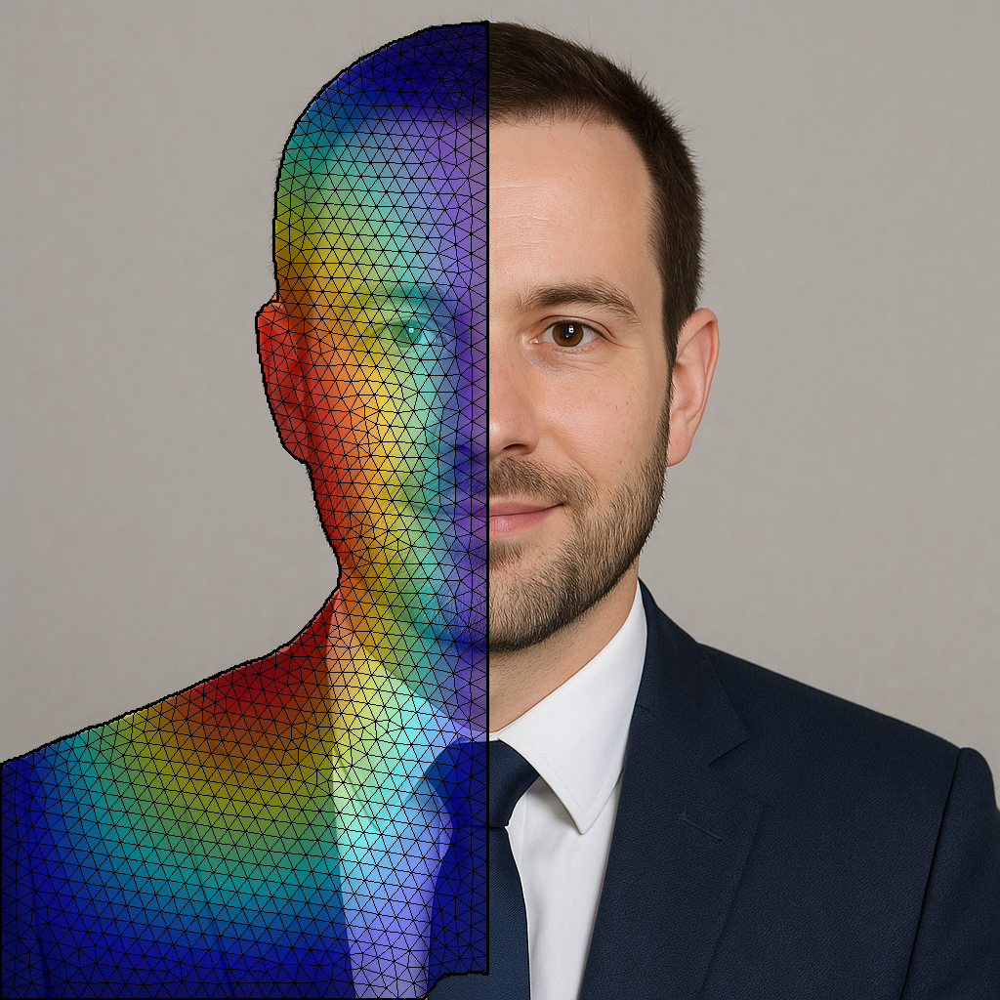
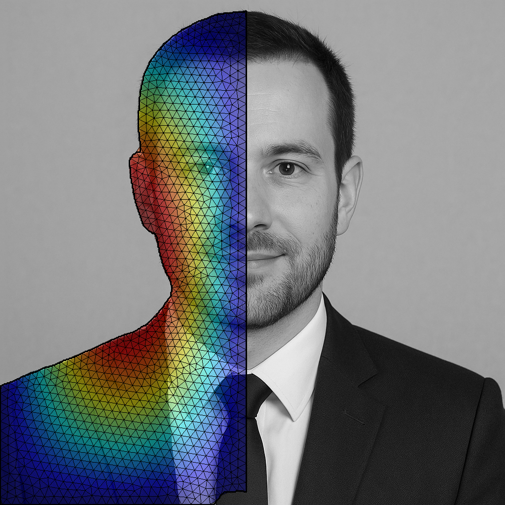
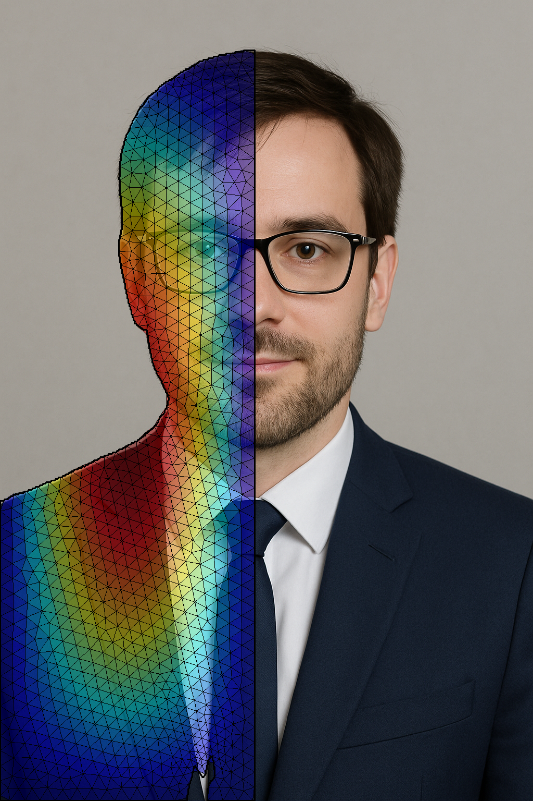
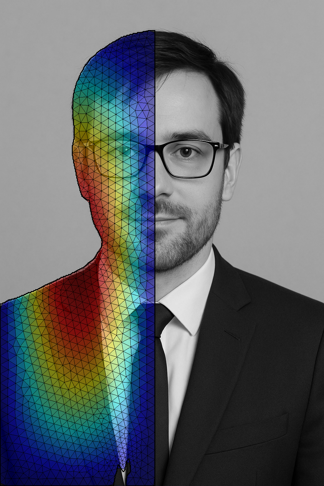

## Photo Mesh Pipeline

Extract a face contour from a photo, generate a 2D triangular mesh with Gmsh, and overlay a synthetic PDE solution on the face region.

### Features
- Face parsing with BiSeNet (pretrained weights)
- Midline detection with MediaPipe FaceMesh
- 2D mesh generation from the face contour (Gmsh)
- Synthetic PDE visualization and image-colored mesh overlays
- Clean input/output separation (`inputs/` → `output/`)

### Requirements
- Python 3.11 (recommended)
- System packages: none required beyond a working Python toolchain

### Setup
```bash
python3 -m venv venv
source venv/bin/activate
pip install -U pip
pip install -r requirements.txt
```


### Model and Weights
This project uses an open-source BiSeNet implementation and pretrained weights:

- `model.py` and `resnet.py` are adapted from the Face Parsing BiSeNet implementation (CelebAMask-HQ):
  - Repository: `https://github.com/zllrunning/face-parsing.PyTorch`
  - Original backbone and segmentation modules were refactored locally for this pipeline.

- Pretrained parsing weights (BiSeNet on face parsing) can be downloaded from the same repository releases or mirrors, for example:
  - `79999_iter.pth` (checkpoint used here): `https://drive.google.com/file/d/154JgKpzCPW82qINcVieuPH3fZ2e0P812/view` (linked from the repo README)

Place the downloaded `79999_iter.pth` in the project root before running.

### Project Layout
- `main.py` — pipeline entrypoint and CLI
- `model.py`, `resnet.py` — BiSeNet model and backbone
- `writer_dat.py` — writes subdivided Tecplot `.dat` from the coarse mesh and image
- `inputs/` — put your input images here (e.g., `input_01.jpg`)
- `output/` — all generated artifacts per input image basename

### Usage
Run the pipeline on an input image (with optional alpha):
```bash
source venv/bin/activate
python main.py inputs/input_01.jpg --alpha 0.45
```

Outputs are written to `output/` with meaningful names that include alpha (percent):
- `<name>_overlay_color_alphaXX.png` (color background)
- `<name>_overlay_gray_alphaXX.png` (grayscale background)

### Examples

<table>
  <thead>
    <tr>
      <th>Input</th>
      <th>PDE contour overlay</th>
      <th>Solution coarse mesh</th>
    </tr>
  </thead>
  <tbody>
    <tr>
      <td></td>
      <td></td>
      <td></td>
    </tr>
    <tr>
      <td></td>
      <td></td>
      <td></td>
    </tr>
  </tbody>
  </table>

### Implementation Notes
- Mesh generation uses Gmsh (Python API) with Frontal-Delaunay for quality triangulation constrained to the face contour.
- Only two images are written to `output/`: `<name>_mesh_pde_contour_overlay.png` and `<name>_overlay_solution_coarse_mesh.png`.
- The PDE solution is synthetic (normalized product of sines). Replace with your solver as needed.

### Troubleshooting
- If MediaPipe cannot detect a face, ensure the image has a clear, frontal face.
- If Gmsh import fails, upgrade pip and retry: `pip install -U gmsh`. Ensure you run inside the venv’s Python.

